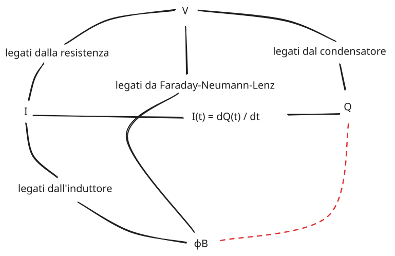

---
description:
  Potenza ed energia nei circuiti elettrici. Resistori, condensatori e induttori
  in serie e parallelo. Studio dei circuiti rc con carica e scarica completa.
lang: it
title: Circuiti rc e componenti in serie e parallelo
---

## Potenza ed energia elettrica

Se colleghiamo un generatore a un dipolo, avremo una corrente e una differenza
di potenziale.

Definiamo la potenza dissipata dal circuito come:

$$
P(t) = I(t)\ V(t)
$$

Possiamo creare un grafico con $I(t)$ sull'asse verticale e $V(t)$
sull'orizzontale. Il grafico della funzione potenza sarà sempre nel 1° o 3°
quadrante, dato che corrente e tensione sono sempre o entrambe positive o
entrambe negative.

L'energia immagazzinata da un circuito elettrico si può esprimere come la
potenza utilizzata per un certo periodo di tempo:

$$
E(t_1, t_2) = \int_{t_1}^{t_2} P(t)\ dt = \int_{t_1}^{t_2} I(t)\ V(t)\ dt
$$

Per il condensatore:

$$
E(t_1, t_2) = C \int_{t_1}^{t_2} \frac{dV}{dt}(t)\ V(t)\ dt = C \int_{V(t_1)}^{V(t_2)} V(t)\ dV(t) = \left[\frac{1}{2} C V(t)^2\right]_{V(t_1)}^{V(t_2)}
$$

Per l'induttore:

$$
E(t_1, t_2) = L \int_{t_1}^{t_2} I(t)\ \frac{dI}{dt}\ dt = L \int_{I(t_1)}^{I(t_2)} I(t)\ dI(t) = \left[\frac{1}{2} L I(t)^2\right]_{I(t_1)}^{I(t_2)}
$$

## Legame tra le grandezze elettromagnetiche



## Elementi in serie e in parallelo

### Resistori in serie

Prendiamo $n$ resistori in serie $R_1, \ldots, R_n$.

La differenza di potenziale è data dalla somma di tutte le differenze di
potenziale dei singoli resistori. La corrente che attraversa il circuito è la
stessa per ogni resistore.

$$
V_\text{tot}(t) = \sum_{i = 1}^n V_{R_i}(t)
$$

$$
R_\text{tot} = \frac{V_\text{tot}(t)}{I(t)} = \sum_{i = 1}^n R_i
$$

### Resistori in parallelo

Prendiamo $n$ resistori in parallelo $R_1, \ldots, R_n$.

Ogni resistore avrà la stessa differenza di potenziale ai suoi capi. Ciò che
cambia è la corrente che attraversa ciascun ramo.

$$
I_\text{tot}(t) = \sum_{i = 1}^n \frac{V(t)}{R_i}
$$

$$
\frac{1}{R_\text{tot}} = \frac{I_\text{tot}(t)}{V(t)} = \sum_{i = 1}^n \frac{1}{R_i}
$$

### Condensatori in serie

Prendiamo $n$ condensatori in serie $C_1, \ldots, C_n$.

La carica sulle armature è la stessa per tutti i condensatori, mentre la
differenza di potenziale totale sarà:

$$
V_\text{tot}(t) = \sum_{i = 1}^n V_i(t) = \sum_{i = 1}^n \frac{Q(t)}{C_i}
$$

$$
\frac{1}{C_\text{tot}} = \frac{V_\text{tot}(t)}{Q(t)} = \sum_{i = 1}^n \frac{1}{C_i}
$$

### Condensatori in parallelo

Prendiamo $n$ condensatori in parallelo $C_1, \ldots, C_n$.

La carica totale si distribuisce in maniera non uniforme sulle armature, mentre
la differenza di potenziale è uguale per tutti.

$$
Q_\text{tot}(t) = \sum_{i = 1}^n Q_i(t) = \sum_{i = 1}^n C_i V(t)
$$

$$
C_\text{tot} = \sum_{i = 1}^n \frac{Q_\text{tot}(t)}{V(t)} = \sum_{i = 1}^n C_i
$$

### Induttori in serie

Prendiamo $n$ induttori in serie $L_1, \ldots, L_n$.

L'induttanza, come la resistenza, è proporzionale alla lunghezza. In questo caso
l'induttore ha lo stesso comportamento del resistore e quindi:

$$
L_\text{tot} = \sum_{i = 1}^n L_i
$$

### Induttori in parallelo

Prendiamo $n$ induttori in parallelo $L_1, \ldots, L_n$.

La corrente si distribuisce su ogni ramo. La differenza di potenziale è la
stessa per tutti gli induttori.

$$
I_\text{tot}(t) = \sum_{i = 1}^n I_i(t) = \sum_{i = 1}^n \frac{1}{L_i} \int_0^t V(t)\ dt = \int_0^t V(t)\ dt\ \sum_{i = 1}^n \frac{1}{L_i}
$$

$$
\frac{1}{L_\text{tot}} = \frac{I_\text{tot}(t)}{\int_0^t V(t)\ dt} = \sum_{i = 1}^n \frac{1}{L_i}
$$

## Circuiti RC

Prendiamo un circuito formato da un generatore di tensione $V$, una resistenza
$R_1$ e poi in parallelo un condensatore $C$ e un'altra resistenza $R_2$.

Sopra $C$ c'è un interruttore che permette di collegare o staccare il
generatore; definiamo la fase di carica quando l'interruttore è in posizione $a$
e la fase di scarica quando è in posizione $b$.

```
# carica
┌──R_1─a\ b┐         ┌──R_1──┐
│+      │  │         │+      │
V_s     C  R_2  ──>  V_s     C
│-      │  │         │-      │
└───────┴──┘         └───────┘

# scarica
┌──R_1─a /b─┐         ┌────┐
│+       │  │         │+   │
V_s      C  R_2  ──>  C    R_2
│-       │  │         │-   │
└────────┴──┘         └────┘
```

In entrambi i casi la corrente scorre in senso orario.

### Fase di scarica

Consideriamo il sistema:

$$
\begin{cases}
-I_{R_2}(t) - I_C(t) = 0 \\
-V_C(t) + V_{R_2}(t) = 0 \\
V_{R_2}(t) = R_2\, I_{R_2}(t) \\
I_C(t) = C \frac{dV_C}{dt}(t) \\
V_C(t_0) = V_s
\end{cases}
$$

Semplificando, otteniamo un problema di Cauchy:

$$
\begin{cases}
C \frac{dV_C}{dt}(t) = - \frac{V_C(t)}{R_2} \\
V_C(t_0) = V_s
\end{cases}
$$

Definiamo la **costante di tempo** $\tau = C\ R_2$. Rappresenta il tempo
necessario a raggiungere il 63,2% della tensione massima ai capi del
condensatore o il tempo necessario perché essa scenda al 38.6% del valore
massimo.

$$
\begin{cases}
\frac{dV_C}{dt}(t) = - \frac{V_C(t)}{\tau} \iff \int_{V_C(t_0)}^{V_C(t)} \frac{dV_C(t)}{V_C(t)} = - \frac{1}{\tau} \int_{t_0}^t dt \\
V_C(t_0) = V_s
\end{cases}
$$

$$
\begin{cases}
\ln(V_C(t)) - \ln(V_C(t_0)) = - \frac{t}{\tau} \\
V_C(t_0) = V_s
\end{cases}
$$

Abbiamo trovato la funzione che dà la differenza di potenziale in base al tempo
durante la scarica del circuito:

$$
\ln(V_C(t)) = \ln(V_s) - \frac{t}{\tau} \iff V_C(t) = V_s\ e^{- \frac{t}{\tau}}
$$

### Fase di carica

Consideriamo il sistema:

$$
\begin{cases}
I_{R_1}(t) - I_C(t) = 0 \\
-V_s + V_{R_1}(t) + V_C(t) = 0 \\
V_{R_1}(t) = R_1\, I_{R_1}(t) \\
I_C(t) = C \frac{dV_C}{dt}(t) \\
V_C(t_0) = 0
\end{cases}
$$

Semplificando, otteniamo un altro problema di Cauchy:

$$
\begin{cases}
C \frac{dV_C}{dt}(t) = \frac{V_s - V_C(t)}{R_1} \\
V_C(t_0) = 0
\end{cases}
$$

Questa volta $\tau = C\ R_1$.

$$
\begin{cases}
\frac{dV_C}{dt}(t) = \frac{V_s - V_C(t)}{\tau} \iff \int_{V_C(t_0)}^{V_C(t)} \frac{dV_C(t)}{V_s - V_C(t)} = \frac{1}{\tau} \int_{t_0}^t dt \\
V_C(t_0) = 0
\end{cases}
$$

$$
\begin{cases}
-\ln(V_s - V_C(t)) + \ln(V_s - V_C(t_0)) = \frac{t}{\tau} \\
V_C(t_0) = 0
\end{cases}
$$

E ora abbiamo trovato la funzione che dà la differenza di potenziale in base al
tempo durante la carica del circuito:

$$
\ln(V_s - V_C(t)) - \ln(V_s - V_C(t_0)) = - \frac{t}{\tau} \iff V_C(t) = V_s (1 - e^{- \frac{t}{\tau}})
$$

Alcuni punti interessanti:

- $V_C(\tau) = V_s (1 - e^{-1})$
- $V_C(4 \tau) = V_s (1 - e^{-4})$: corrispondente a circa il 98% della tensione
  massima.
