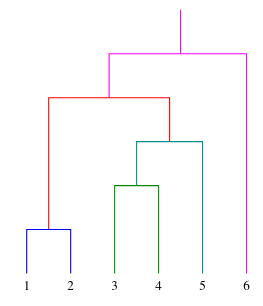

## Bottom-up: agglomerative clustering

Nel clustering agglomerativo, si parte da piccoli sottoinsiemi e ad ogni ciclo
si uniscono quelli più simili.

Anche in questo caso si richiede di stabilire una misura di distanza tra 2
gruppi. Ci sono 3 scelte principali, che funzionano bene a seconda della
tipologia di input: distanza media tra i punti, distanza minima e distanza
massima.

### Algoritmo di merging

Dato un insieme di clusters $C$:

1. Prendi i clusters $D$ e $E$ con la distanza minima tra loro;
2. Sostituisci $D$ e $E$ con la loro unione, registra la distanza $y_i$ tra i 2
   insiemi, e ripeti;

### Dendrogramma

L'algoritmo può essere visualizzato attraverso un albero, dove le foglie sono i
punti iniziali e la radice è l'insieme totale degli input.

L'altezza di ogni nodo è data dalla distanza tra i 2 rami (sottoinsiemi), cioè
la $y_i$ registrata in precedenza.

Il punto in cui si vuole tagliare orizzontalmente l'albero determina dove
fermare l'algoritmo.

## Distanza di Mahalanobis

Per una distribuzione sferica simmetrica rispetto agli assi:

1. si calcola la media $mu$ dei punti;
2. si calcola la deviazione standard $sigma$ delle distanze dei punti dalla
   media;
3. per ogni punto: $x' = (x - mu) / sigma$;

Questa procedura basta quando la distribuzione è sferica, cioè quando le
componenti dei punti sono incorrelate e hanno la stessa varianza lungo ogni
direzione. Se la distribuzione non è sferica, però, la semplice
standardizzazione non basta più: le componenti sono correlate e la dispersione
dipende dalla direzione, quindi la distanza euclidea dalla media non riflette la
vicinanza effettiva al cluster.

La distanza di Mahalanobis generalizza questa idea al caso non sferico: misura
la distanza di un punto dalla media del cluster in unità di deviazione standard
lungo le direzioni principali, come se lo spazio venisse trasformato in modo da
rendere la distribuzione sferica. Per questo la matrice di covarianza $S$
compare al denominatore attraverso la sua inversa. La distanza di Mahalanobis di
un vettore $x$ da un cluster di punti con media $mu$ e matrice di covarianza $S$
è definita:

$$
delta_M(x) = sqrt((x - mu)^T S^(-1) (x - mu))
$$

:::tip

Nel caso sferico, in cui $S = sigma^2 bold(I)$, la formula si riduce alla
distanza standardizzata del passo 3: $delta_M(x) = norm(x - mu) / sigma$.

:::

## Self-organizing maps

Una mappa è una funzione che prende input n-dimensionali e li suddivide in celle
(su una mappa bidimensionale) a seconda della distanza tra loro.

$$
p_i(t + 1) = p_i(t) + n(t) op("activation")(c(x), i, sigma(t)) thin (x - p_i(t))
$$

Con il passare del tempo, ogni neurone si specializza e lo stimolo di
attivazione influisce sempre meno sui neuroni circostanti.

Le SOMs sono utili quando si vogliono visualizzare dati ad alta dimensionalità:
proiettano gli input su una mappa bidimensionale preservando le relazioni di
vicinanza, quindi punti simili finiscono in celle vicine. Vengono usate per:

- esplorazione di dati non etichettati, per individuare pattern nascosti e
  gruppi di punti simili in modo non supervisionato;
- riduzione dimensionale, poiché rappresentano dati n-dimensionali su una
  griglia a 2 dimensioni;
- visualizzazione dei risultati del clustering, mostrando quali regioni della
  mappa corrispondono a classi o cluster diversi;
- rilevamento di anomalie: un punto che non si avvicina a nessun neurone
  specializzato è probabilmente un outlier.
