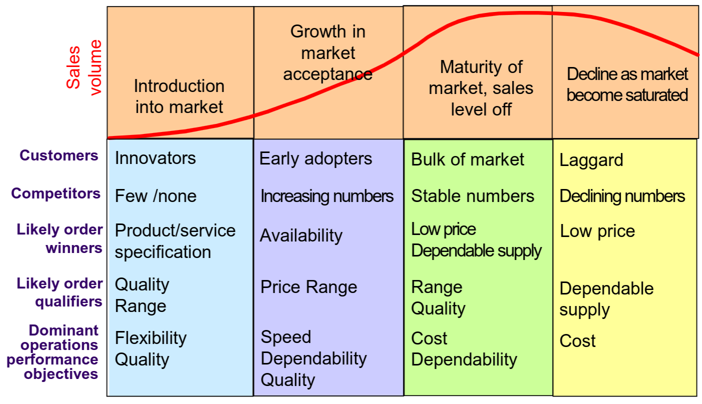
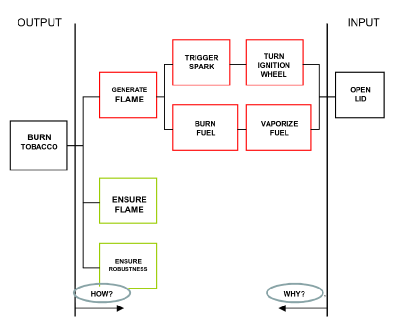

---
description:
  Fallimento dei nuovi prodotti, ciclo di vita, modello stage-gate per la
  progettazione, tecniche QFD e FMEA per valutazione, analisi FAST e distinta
  base BOM.
lang: it
title: Sviluppo nuovo prodotto e modello stage-gate
---

## Sviluppo di un nuovo prodotto

Il 60-80% dei nuovi prodotti lanciati sul mercato fallisce. Le principali cause
sono:

- L'azienda non è in grado di gestire l'aumento di capacità produttiva richiesto
  dal successo del prodotto. Dopo un po' i clienti perdono interesse.
- Il prodotto non è all'altezza delle aspettative e viene criticato.
- Il prodotto non si differenzia rispetto agli altri sul mercato.
- Il prodotto definisce una nuova categoria, ma i consumatori non riescono a
  cogliere il potenziale.
- Il prodotto è rivoluzionario ma non c'è mercato. La sua complessità fa
  lievitare i costi e nessuno ritiene che il prezzo sia adeguato.

### Fasi del ciclo di vita di un prodotto

## Processo di sviluppo

Per progettare un nuovo prodotto si definiscono 3 aspetti chiave:

- **concept**: insieme dei benefici che il cliente si aspetta dal prodotto;
- **package**: insieme dei prodotti e servizi che provvedono al raggiungimento
  dei benefici attesi. Definizione dei componenti core e supporting;
- **process**: la relazione tra i componenti del package determina i processi di
  realizzazione del prodotto finale;

### Fasi di progettazione (modello stage-gate)

Il modello stage-gate prevede fasi (stage) separate da punti di valutazione
(gate) con decisione go/no-go:

1. **Ideazione del concept**: si prendono idee da R&D, competitors, clienti,
   ricerche di mercato, staff e si definiscono funzioni, forma, benefici e scopo
   del nuovo prodotto.

2. **Screening**: studio di fattibilità, accettabilità, vulnerabilità.

3. **Progettazione preliminare**: si definiscono prodotti e servizi che
   costituiranno il package e processi a supporto della creazione del package.

   Le distinte base (Bills of Materials) evidenziano le quantità di materie
   prime richieste per ogni componente.

4. **Valutazione e miglioramento**: dagli output della progettazione preliminare
   si effettua la valutazione delle alternative, in modo da effettuare
   miglioramenti prima del lancio.

   Tecniche comunemente utilizzate sono:

   - **Quality Function Deployment (QFD)**: traduce i desideri del cliente
     (what) nelle specifiche tecniche del prodotto (how).
   - **Failure Mode and Effects Analysis (FMEA)**: analizza i potenziali guasti
     di un prodotto: come si rompe, perché si rompe e quali conseguenze ha la
     rottura.
   - **Analisi del Valore**: analizza il rapporto tra soddisfazione della
     funzione e risorse utilizzate.

5. **Prototipazione e progettazione finale**;

### Analisi FAST

La Functional Analysis System Technique permette di valutare alternative
tecnologiche per migliorare le funzioni senza essere vincolati a soluzioni
specifiche.

### Distinta base (Bill of Materials (BOM))

La distinta base rappresenta la struttura fisica del prodotto come albero
rovesciato.

- La radice è il prodotto finale.
- I rami sono sottoinsiemi di componenti che lo compongono.

Il BOM è fondamentale per la pianificazione della produzione (ordini,
magazzino).
