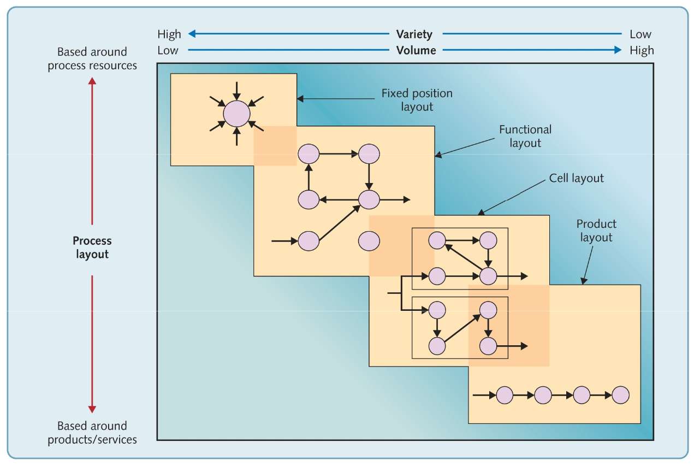
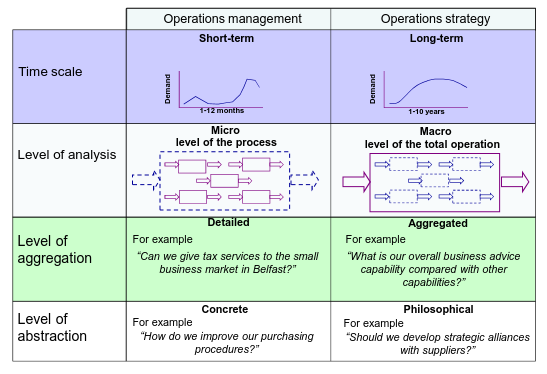
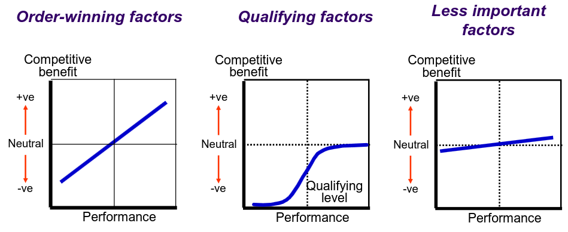

---
description:
  Classificazione dei processi per volume e varietà, layout produttivi,
  operations management versus strategy e fattori di performance order
  qualifying e winning.
lang: it
title: Tipologie produttive layout e performance
---

## Tipologie di processi produttivi

| Processo                        | Volume      | Varietà     | Esempio                                             |
| ------------------------------- | ----------- | ----------- | --------------------------------------------------- |
| **Progetto**                    | Molto basso | Molto alta  | Cantieristica, ingegneria civile, film              |
| **Job Shop (Reparti)**          | Basso       | Alta        | Aziende meccaniche artigiane, arredamento su misura |
| **Produzione su Lotti (Batch)** | Medio       | Media       | Tessile, alimentare                                 |
| **Produzione in Linea**         | Alto        | Bassa       | Industria automobilistica                           |
| **Ciclo Continuo**              | Molto alto  | Molto bassa | Raffinerie, chimico, petrolchimico                  |

## Layout produttivi

Varie tipologie di processo produttivo hanno bisogno di layout diversi che
garantiscano sicurezza ed ergonomia per il personale e chiarezza ed efficienza
nell'utilizzo dello spazio.

- **Postazione fissa**: il prodotto rimane in un punto fisso e tutte le risorse
  convergono verso di esso. Richiede un'elevata necessità di coordinamento.

- **Layout funzionale**: ogni area è organizzata per funzione. Diversi prodotti
  seguono percorsi diversi.

- **Layout a cella**: diverse celle di produzione con strumenti replicati in
  ogni area. C'è una maggiore ridondanza, ma risulta più facile coordinare i
  flussi per famiglia di prodotto.

  Risulta economicamente conveniente quando i volumi sono più elevati.

- **Layout di linea**: il flusso è predeterminato dal prodotto. Utilizzabile
  solo con prodotti standardizzati.

  La versione estrema è la produzione a ciclo continuo.

## Volume e varietà nei servizi

La matrice volume-varietà si applica anche ai servizi, con tre aree principali:

| Area                      | Volume | Varietà | Esempio                                            |
| ------------------------- | ------ | ------- | -------------------------------------------------- |
| **Professional Services** | Basso  | Alta    | Consulenza, ristorante gourmet                     |
| **Service Shop**          | Medio  | Media   | Banche, hotel                                      |
| **Mass Services**         | Alto   | Bassa   | Trasporti pubblici, utenze telefoniche, McDonald's |

## Operations management vs. Operations strategy

L'operations management racchiude le decisioni operative quotidiane, la gestione
delle attività produttive e l'analisi e il miglioramento continuo dei processi.
L'operations strategy si occupa di decisioni a lungo termine che contribuiscono
alla strategia complessiva dell'azienda.

La riconciliazione strategica è il processo di allineamento tra i requisiti del
mercato (richieste dei clienti) e le capacità operative dell'azienda.

## Fattori di performance

I fattori **order-qualifying** sono quelli necessari per partecipare alla
competizione. Quelli **order-winning** sono quelli che permettono di vincere la
competizione.

I processi possono essere valutati secondo diverse metriche:

- **qualità**: minimizzazione degli errori;
- **velocità**: capacità di soddisfare una maggior domanda;
- **affidabilità**: tempi e volumi di processo prevedibili;
- **flessibilità**: risorse con una gamma di capacità;
- **costo**: eliminazione degli sprechi, non solo economici ma anche energetici
  ed ecologici;
- **sostenibilità**: rispetto ambientale, integrazione nell'economia circolare;
