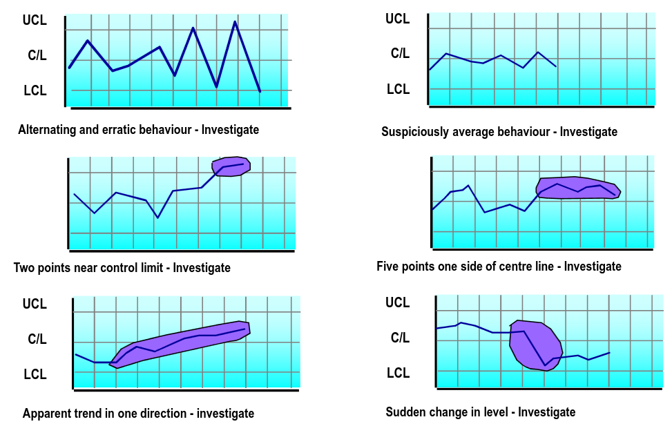

---
description:
  Le prospettive Garvin sulla qualità, dimensioni misurabili, standard ISO 9001,
  costi di prevenzione e guasto, controllo statistico e total quality
  management.
lang: it
title: Garvin, costi qualità e controllo statistico
---

## Gestione della qualità

Nel 1984, Garvin propose 5 diverse prospettive per definire la qualità:

- product-based: un insieme di determinate caratteristiche;
- manufacturing-based: senza difetti;
- value-based: rapporto qualità/prezzo;
- user-based: prodotto adatto all'utilizzo;
- transcendent: eccellenza innata e intangibile;

### Misura della qualità

L'ANSI definisce la qualità come la totalità delle specifiche e caratteristiche
di un prodotto o servizio su cui si basa la sua capacità di soddisfare
determinati bisogni.

Alcune dimensioni misurabili:

- **performance**: rispetto a quella attesa e a quella dei concorrenti;
- **estetica**: aspetto, sensazioni, odore, gusto, ecc.;
- **conformità**: rispetto alle aspettative e agli standard;
- **affidabilità/durata**: capacità del prodotto di funzionare nel tempo;
- **qualità percepita**: valutazione indiretta (es. reputazione del prodotto);
- **servizio post-vendita**: gestione dei reclami o verifica della loro
  soddisfazione;

### ISO 9001

ISO 9001 è uno standard internazionale applicabile a tutte le organizzazioni,
operanti in qualsiasi settore.

Si basa su 8 principi di gestione:

- focalizzazione sul cliente;
- leadership;
- coinvolgimento del personale;
- approccio per processi;
- approccio sistemico alla gestione;
- miglioramento continuo;
- decisioni basate su dati di fatto;
- rapporti di reciproco beneficio con i fornitori;

### Costi della Qualità

- Costi di prevenzione (proattivi):
  - progettazione dei processi per anticipare problemi;
  - formazione del personale;
  - controllo preventivo;

- Costi di valutazione (misura):
  - monitoraggio e verifica dei processi;
  - raccolta e analisi dati;

- Costi di guasto interno (reattivi):
  - scarti e materiali rovinati;
  - rielaborazione di pezzi e materiali;

- Costi di guasto esterno (reattivi):
  - resi, rimborsi, sostituzioni;
  - perdita di clienti e fedeltà;
  - impatto sull'immagine aziendale;
  - spese sanitarie/assicurative (casi gravi);

#### Approccio all'investimento nella qualità

L'approccio tradizionale cerca il punto di minimo della somma tra costi di
prevenzione/valutazione e costi di guasto. Presuppone un livello ottimale di
qualità.

Nel total quality management non esiste un punto ottimale. L'azienda deve
investire continuamente in qualità. Nel lungo termine, i costi della qualità
tendono a diminuire.

Nel modello a cono di sabbia, le aziende che si comportano meglio pongono la
qualità come prima competenza, sviluppando progressivamente le altre
prestazioni.

### Controllo statistico di processo

Il controllo statistico di processo prevede il monitoraggio temporale dei dati
di processo per distinguere **variabilità casuale** (accettabile) da
**variabilità da cause speciali** che richiede un intervento.

Il control chart definisce un limite di controllo superiore (UCL) e inferiore
(LCL). Se un punto cade fuori dai limiti allora il processo è fuori controllo.

