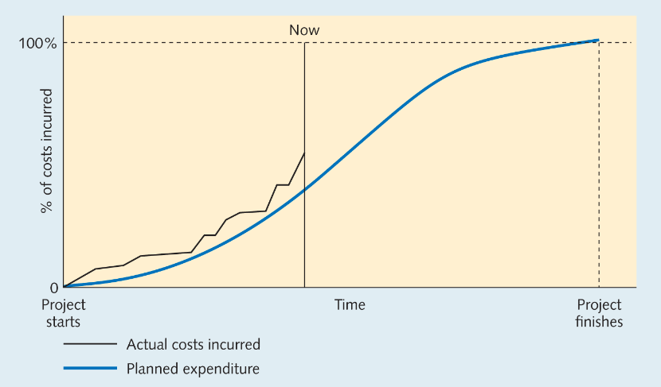
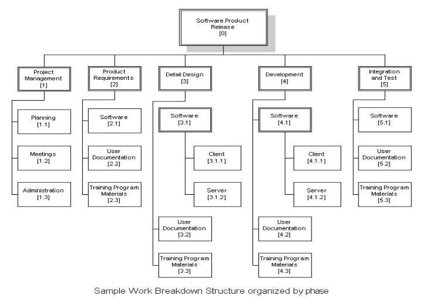
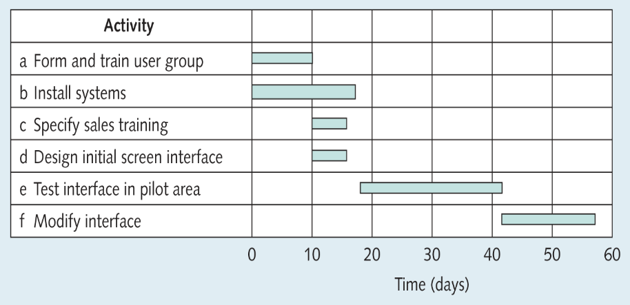
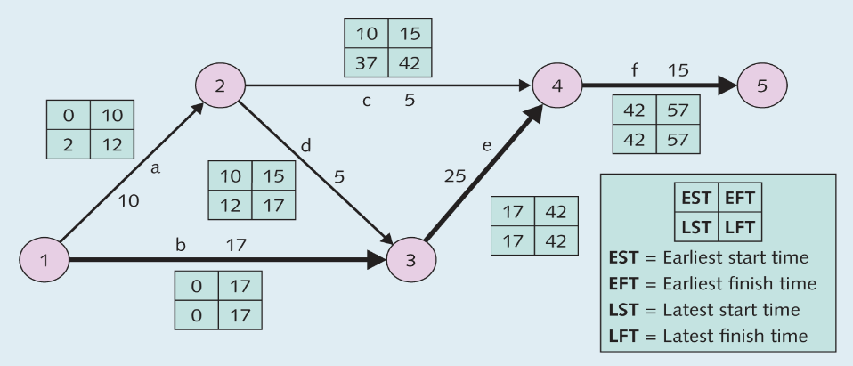
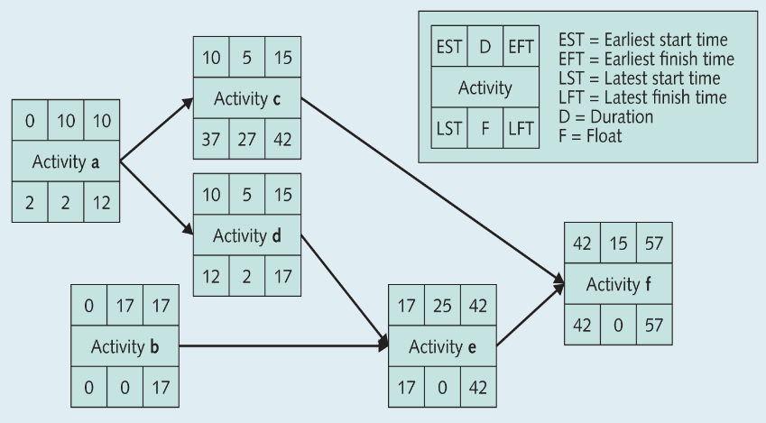
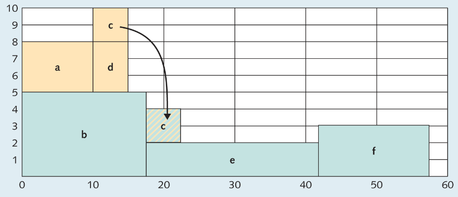

---
description:
  Definizioni di progetto, WBS, cammino critico, diagrammi di Gantt, KPI,
  metriche di costo e gestione delle risorse con matrice RACI e ruolo del
  project manager
lang: it
title: Gestione di progetto con WBS, KPI e risorse
---

## Project management

- **Programma**: è un'iniziativa a lungo termine, di norma implicante più di un
  progetto.
- **Progetto**: è un insieme complesso di attività integrate, con obiettivi,
  schedulazioni e budget definiti, caratterizzato da un inizio ed una fine
  solitamente compresi in un periodo di 3 anni.
- **Compito**: è uno sforzo a breve termine, che insieme ad altri costituisce un
  progetto.

Il progetto è un'attività unica e non ripetitiva, con obiettivi specifici e
durata definita e con budget, programmazione e struttura organizzativa dedicati.

Il project management è l'applicazione di conoscenze, abilità, strumenti e
tecniche a un'ampia gamma di attività, per soddisfare i requisiti di uno
specifico progetto.

### Variabili di progetto

Quattro variabili definiscono ogni progetto: **tempi**, **costi**, **risorse** e
**qualità**.

I vincoli sulle risorse generano un trade-off tra tempi, costi e qualità.

### Fasi di progetto

Un progetto include 3 fasi principali:

- **pianificazione**: definizione del progetto, fissazione degli obiettivi e
  organizzazione del team;
- **scheduling**: allocazione di persone, denaro e risorse alle attività e
  definizione delle relazioni tra esse;
- **controllo**: monitoraggio delle risorse, costi e qualità e revisione dei
  piani per rispettare tempi e costi;

### Difficoltà di un progetto

La difficoltà di un progetto dipende da tre dimensioni:

- **scala**: dimensione del progetto, budget, persone coinvolte;
- **complessità**: numero e interazione delle attività e degli stakeholder;
- **incertezza**: mancanza di conoscenza a priori sui requisiti, le tecnologie e
  gli output;

### Metriche di progetto

I costi vengono monitorati attraverso tre metriche principali:

- Budgeted Cost of Work Scheduled (**BCWS**): costo pianificato per
  l'avanzamento previsto;
- Actual Cost of Work Performed (**ACWP**): costo effettivamente sostenuto;
- Budgeted Cost of Work Performed (**BCWP**): valore delle attività realizzate;

### Key Performance Indicators (KPI)

I KPI sono indicatori quantitativi e misurabili che permettono di valutare in
modo oggettivo l'avanzamento e la performance di un progetto rispetto agli
obiettivi pianificati.

Un buon KPI è:

- specific: specifico e chiaramente definito;
- measurable: misurabile in modo oggettivo;
- achievable: raggiungibile e realistico;
- relevant: rilevante per gli obiettivi;
- time-bound: definito nel tempo;

I KPI si organizzano lungo le 4 variabili di progetto:

- tempi:
  - Schedule Variance (SV): BCWP - BCWS;
  - Schedule Performance Index (SPI): BCWP / BCWS;
  - milestone raggiunte / pianificate;
  - ritardo medio delle attività;
- costi:
  - Cost Variance (CV): BCWP - ACWP;
  - Cost Performance Index (CPI): BCWP / ACWP;
  - Burn rate: denaro speso a settimana;
  - ROI atteso / payback period;
- risorse:
  - utilizzo risorse / capacità;
  - productivity rate: output persona / giorno;
  - ore di overtime / totali;
  - turnover del team di progetto;
- qualità:
  - tasso di difetti / totale;
  - rilavorazioni / scarti;
  - customer satisfaction (CSAT, NPS);
  - requisiti soddisfatti / totali;

### Work breakdown structure (WBS)

L'approccio divide et impera suddivide il progetto in porzioni gestibili (work
packages). Si genera così una struttura gerarchica ad 'albero genealogico'.

Le **milestone** sono eventi che segnano il completamento dei deliverable
principali del progetto.

L'unità di livello più basso della WBS è il work package (WP), che costituisce
l'insieme di attività elementari che interagiscono con gli altri WP.

Un WP è determinato univocamente da: input richiesti, output prodotti, risorse
necessarie e responsabilità.

### Diagrammi di Gantt

Il diagramma di Gantt è un tipo di grafico a barre che illustra la
pianificazione di un progetto, con le date di inizio e fine delle attività e
delle macro-fasi. Serve a visualizzare le precedenze e dipendenze tra le
attività.

Le barre rappresentano i work packages della WBS.

### Critical path method (CPM)

Il CPM è una tecnica usata per modellare e analizzare la pianificazione del
progetto. Richiede una lista di tutte le attività (WBS), la durata stimata e le
dipendenze di ciascuna.

Il cammino critico è la sequenza di attività con la durata totale più lunga del
progetto. Qualunque ritardo su un'attività del cammino critico ritarda l'intero
progetto.

Il **crashing** consiste nel velocizzare il cammino critico aumentando il numero
di risorse dedicate alle sue attività. Il costo aumenta sempre di più
all'incrementare della riduzione dei tempi.

### Network diagram

Rappresenta le dipendenze tra attività in un grafo.

### CPM activity-on-node

Ogni attività è un nodo con i tempi early/late e dipendenze come archi.

### Float e profilo risorse

Il float (scorrimento) può essere usato per livellare il consumo di risorse nel
tempo.

## Gestione delle risorse

Esistono due tipi di manager:

- Manager di funzione: mantiene gli standard di efficienza/efficacia, gestisce e
  mantiene le risorse e le competenze e le mette a disposizione dei progetti
  aziendali.
- Manager di progetto: indirizza le risorse disponibili per perseguire gli
  obiettivi di progetto.

La matrice RACI è lo strumento usato per assegnare responsabilità su attività e
deliverable.

- Responsible: esegue il lavoro, è responsabile del completamento dell'attività;
- Accountable: garantisce che il lavoro sia fatto (uno per attività);
- Consulted: fornisce input/feedback in maniera attiva;
- Informed: viene informato passivamente del risultato;

### Project manager

Il project manager è la figura che individua, impegna e coordina le risorse al
fine di conseguire gli obiettivi di costi, tempi e qualità del progetto.

Le sue competenze sono:

- visione strategica: imposta il progetto con una visione globale;
- capacità predittiva: intuisce e anticipa le richieste di mercato, clienti e
  problematiche;
- coordinamento: coordina risorse, creando un clima costruttivo;
- leadership: motiva e delega lavoro, mantendendo il controllo sulle attività;
- negoziazione: media tra stakeholder e gestisce conflitti e priorità;
