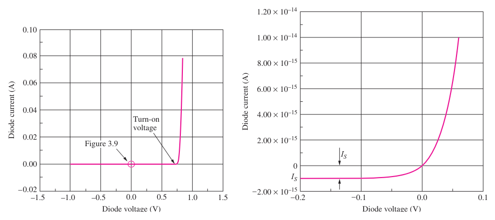

---
description:
  Correnti di diffusione nei semiconduttori, relazione di Einstein, tensione
  built-in della giunzione p-n e modello del diodo con polarizzazione diretta e
  inversa.
lang: it
title: Diffusione e modello del diodo a giunzione p-n
---

## Corrente di diffusione

Se il **drogaggio del silicio non è uniforme**, le concentrazioni dei portatori
variano lungo il cristallo.

All'interno del semiconduttore si generano **correnti di diffusione**
proporzionali al gradiente di concentrazione dei portatori, che si muovono da
regioni a maggiore concentrazione verso regioni a minore concentrazione.

- $j_p^"diff" = (+q) D_p (- nabla p)$
- $j_n^"diff" = (-q) D_n (- nabla n)$

$D_p$ e $D_n$ sono le **diffusività** di lacune ed elettroni.

Mobilità e diffusività sono legate dalla **relazione di Einstein**, che
definisce la **tensione termica** $V_T$ in funzione della temperatura:

$$
V_T = D_n / mu_n = D_p / mu_p = (k T) / q tilde.eq 0.0258 thick "V" ("a 300 K")
$$

## Corrente totale

La corrente totale, che si ottiene applicando un campo elettrico e sommando la
corrente di drift e quella di diffusione, è:

- $j_n^T = q mu_n n E + q D_n nabla n = q mu_n n (E + V_T 1 / n nabla n)$
- $j_p^T = q mu_p p E - q D_p nabla p = q mu_p p (E - V_T 1 / p nabla p)$

## Legame tra campo elettrico e cariche

Si ricorda che il campo elettrico $arrow(E)$ in un semiconduttore con
permittività $epsilon$ varia nello spazio in risposta alla distribuzione di
carica $rho$:

$$
nabla dot (epsilon arrow(E)) = rho
$$

## Processo di costruzione dei circuiti

Un substrato di silicio drogato funge da supporto e aree drogate diversamente
vengono create sulla superficie. Queste aree vengono collegate tramite piste in
alluminio, disposte su diversi strati separati da un isolante.

## Diodo

Un diodo è costituito dalla giunzione tra un blocco di silicio di tipo $p$
(**anodo**) e uno di tipo $n$ (**catodo**). Il suo simbolo circuitale è:

La presenza di un forte gradiente di concentrazione dei portatori genera una
corrente di diffusione dalla zona $p$ alla zona $n$. Al confine tra le due zone
si creano degli ioni: negativi nella zona $p$ e positivi nella zona $n$,
formando così una regione di carica spaziale.

Poiché la corrente totale in equilibrio deve essere nulla, si genera un campo
elettrico e una corrente di drift che bilancia quella di diffusione.

### Tensione di built-in

La tensione che il campo elettrico genera all'interno del diodo viene
solitamente chiamata **tensione di built-in** ($phi_j$).

Per calcolare il suo valore si pone la corrente totale uguale a $0$.

$$
j_p^T = q mu_p p (E - V_T 1 / p nabla p) = 0
$$

da cui:

$$
&    &E = V_T 1 / p nabla p \
&<=> &- nabla V = V_T 1 / p nabla p \
&<=> &dif V = - V_T (dif p) / p \
&<=> &V_2 - V_1 = V_T ln(p_1 / p_2)
$$

$$
phi_j = V_T ln((N_A N_D) / n_i^2)
$$

### Potenziale esterno

Applicando un potenziale esterno al diodo, se ne altera l'equilibrio.

Applicando un **potenziale positivo** (polarizzazione diretta), la regione di
carica spaziale si restringe e la barriera di potenziale si abbassa, permettendo
il flusso di una **corrente di portatori maggioritari** per diffusione.

Un **potenziale negativo** (polarizzazione inversa) allarga la regione di carica
spaziale, facendo sì che la corrente sia **formata prevalentemente dai portatori
minoritari**, poiché la corrente di diffusione viene ostacolata.

### Modello del diodo

$$
i_D = I_S (e^((q v_D) / (n k T)) - 1) = I_S (e^(v_D / (n V_T)) - 1)
$$

Dove:

- $i_D$: corrente che scorre attraverso il diodo;
- $I_S$: corrente di saturazione del diodo;
- $v_D$: tensione ai capi del diodo;
- $q$: carica elementare;
- $k$: costante di Boltzmann;
- $T$: temperatura assoluta in Kelvin;
- $n$: fattore di non idealità (tipicamente $n = 1$);
- $V_T$: tensione termica ($(k T) / q$);
