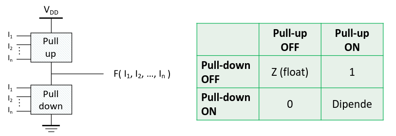
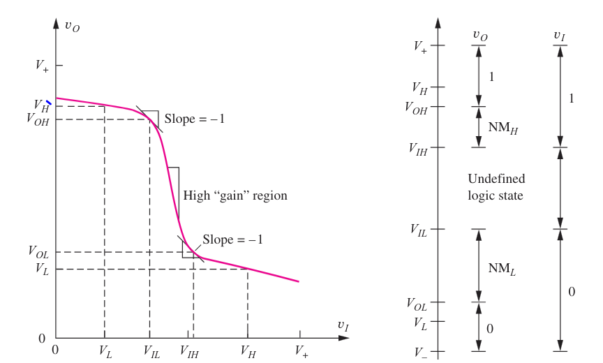
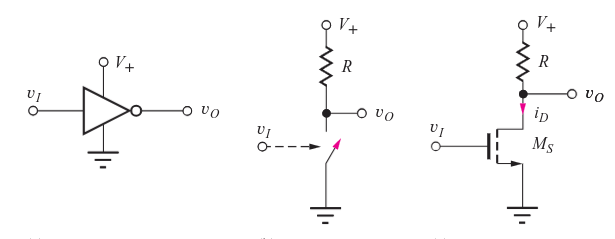
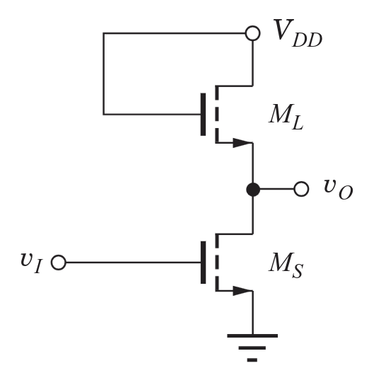
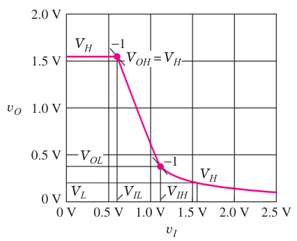
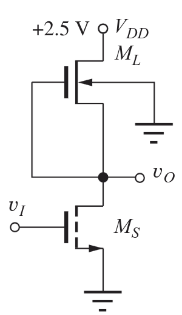
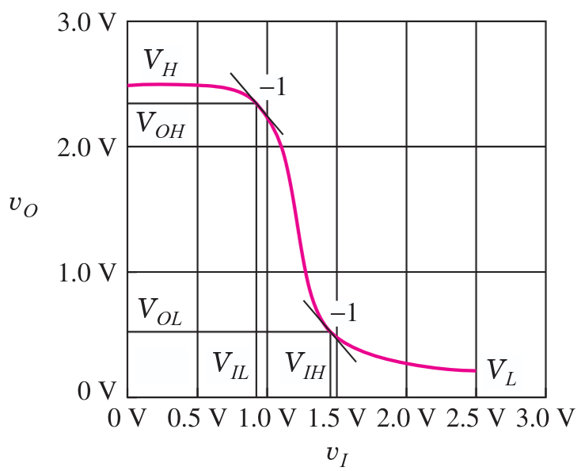

---
description:
  Analisi della caratteristica di trasferimento, margini di rumore e
  implementazioni con MOS resistivo, a carico saturo e depletion mode.
  Specifiche di progetto.
lang: it
title: Invertitori logici, caratteristiche e margini di rumore
---

## Invertitore logico

Nell'invertitore chiameremo $V_+$ (o $V_{DD}$) e $V_-$ le tensioni di
alimentazione e $V_H$ e $V_L$ i livelli alti e bassi della tensione di uscita.

Quando l'ingresso è a $V_+$, l'uscita va a $V_L$. Viceversa, quando l'ingresso è
a $V_-$, l'uscita va a $V_H$.

A livello base, usiamo 2 circuiti per pilotare l'uscita verso il valore alto o
basso. Il **pull down** porta l'uscita a $V_L$ e il **pull up** la porta a
$V_H$. Idealmente, i 2 circuiti dovrebbero attivarsi in maniera mutualmente
esclusiva.

### Funzione caratteristica reale

Per gli invertitori reali, la caratteristica ingresso-uscita non è una funzione
gradino. Bisogna definire dei range di valori per i quali la tensione di
ingresso è considerata alta e bassa.

- $V_{IL}$: è la tensione massima per la quale l'ingresso è considerato basso;
- $V_{IH}$: è la tensione minima per la quale l'ingresso è considerato alto;
- $V_{OL}$: è la tensione di uscita per $V_I = V_{IH}$;
- $V_{OH}$: è la tensione di uscita per $V_I = V_{IL}$;

La regione compresa tra $V_{IL}$ e $V_{IH}$ è detta zona ad alto guadagno
(rispetto al rumore). Infatti, una piccola variazione del segnale di ingresso
viene amplificata e invertita in uscita.

I valori in cui vengono definiti $V_{IL}$ e $V_{IH}$ sono quelli in cui la
tangente della funzione di trasferimento è uguale a $-1$.

### Margine di rumore

Il collegamento in cascata di porte logiche deve essere semplice. Ogni porta
aggiunta diminuisce la tolleranza al rumore del circuito.

Il valore di $V_{OL}$ (valore massimo dell'uscita bassa) della prima porta deve
essere minore di $V_{IL}$ della seconda porta.

Il margine di rumore è definito come la differenza $NM_H = V_{OH} - V_{IH}$
oppure $NM_L = V_{OL} - V_{IL}$. Maggiore è il loro valore, maggiore sarà la
tolleranza del circuito al rumore.

### Specifiche di progetto

Nella progettazione di circuiti con invertitori gli obiettivi sono:

- minimizzare la zona indefinita, rendendo la caratteristica il più verticale
  possibile;
- massimizzare i margini di rumore;
- rendere il dispositivo unidirezionale (l'uscita non può provocare cambiamenti
  sull'ingresso);
- mantenere i livelli di uscita compatibili con quelli di ingresso delle porte
  successive;
- minimizzare, se possibile, l'area occupata e i consumi di potenza,
  massimizzando la velocità;

## Invertitore a carico resistivo

Un transistore MOS viene usato come interruttore.

- Quando $V_I$ è bassa, l'interruttore è aperto e non passa corrente. L'uscita
  viene portata a $V_+$ dalla resistenza $R$.
- Quando $V_I$ è alta, l'interruttore è chiuso e l'uscita è connessa a massa dal
  transistore.

Il problema di questo design è che il circuito di pull-up è sempre attivo e il
transistore deve 'combattere' con il resistore.

## Invertitore nMOS a carico saturo

L'invertitore nMOS usa un altro transistore nMOS come pull-up al posto del
resistore. Chiameremo $M_L$ il pull-up e $M_S$ il pull-down.

$M_L$ è sempre in saturazione, ma la sua tensione di soglia è influenzata da
$V_{SB}$ che è uguale a $V_O$, quindi:

- $V_L$ non andrà mai a $0$.
- $V_H$ non raggiungerà mai il valore di $V_{DD}$.

## Invertitore nMOS depletion mode

Il problema con $V_H$ si può risolvere usando un transistore $M_L$ in depletion
mode, che ha tensione di soglia negativa.

La connessione da source a gate, invece che da drain a gate, è possibile perché
$M_L$ è sempre acceso in questo caso, e il vantaggio è quello di poter limitare
la corrente che passa quando l'uscita è bassa.
