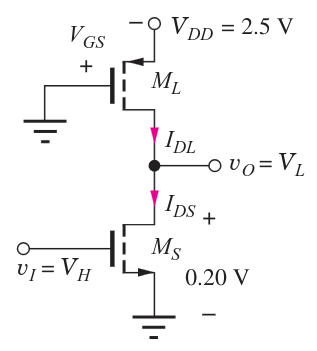
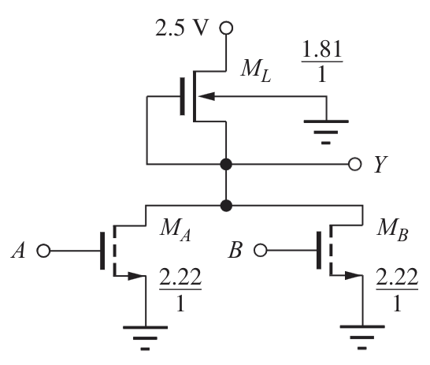
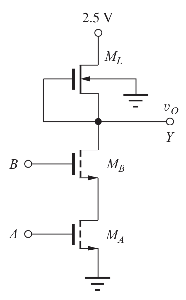

---
description:
  Analisi invertitori pseudo-nMOS e saturazione di velocità. Dimensionamento
  porte NOR e NAND con valutazione ritardi di propagazione e tempi salita e
  discesa.
lang: it
title: Invertitori pseudo-nMOS e porte logiche NOR/NAND
---

## Invertitore pseudo-nMOS

Nell'invertitore pseudo-nMOS il transistore $M_L$ è sostituito con un pMOS con
gate a massa.

## Saturazione di velocità sugli invertitori

Per il transistore di pull-up si ha il rischio di saturazione di velocità:

- Per l'invertitore a carico saturo bisogna accorciare leggermente il canale di
  $M_L$ per compensare la perdita di corrente.
- Per l'invertitore depletion mode non è necessario apportare modifiche, poiché
  $V_{GS} = 0$.
- Per l'invertitore pseudo-nMOS la larghezza di $M_L$ deve essere leggermente
  aumentata per compensare.

## Porte logiche

Per realizzare gli operatori logici si usano transistori in serie e parallelo.

Quelli in serie conducono se e solo se entrambi sono accesi, realizzando una
funzione AND. Quelli in parallelo conducono quando uno di essi è acceso,
realizzando una funzione OR.

### NOR

Per realizzare la NOR si usa un invertitore con due transistori di pull-down in
parallelo.

Quando anche solo uno dei due è acceso, l'uscita diventa bassa. Quindi entrambi
devono essere dimensionati in modo che ciascuno possa portare da solo l'uscita
al livello basso. $V_{DS}$ si dimezza quando entrambi sono accesi.

### NAND

Analogamente, la NAND è formata da un invertitore con due transistori di
pull-down in serie. Perché l'uscita diventi bassa è necessario che entrambi
siano accesi.

Per compensare la maggiore resistenza equivalente dei transistori in serie, si
progettano entrambi con il doppio della larghezza.

## Tempistiche

Definiamo:

- **Ritardo di propagazione**: tempo che intercorre tra la transizione
  dell'ingresso e quella dell'uscita. Per transizione si intende il passaggio
  per il 50% tra $0$ e $V_{DD}$ e viceversa.
- **Tempo di salita (rise) e discesa (fall)**: tempo che impiega l'uscita a
  passare dal 10% al 90% e viceversa.
