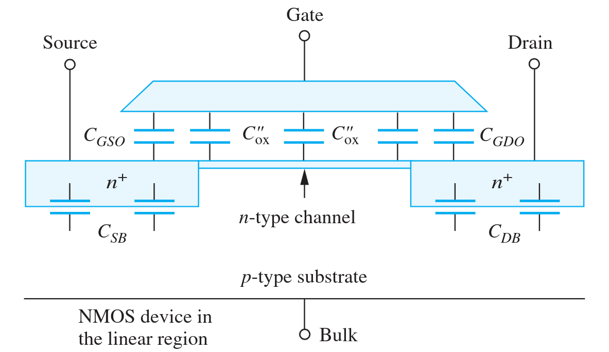
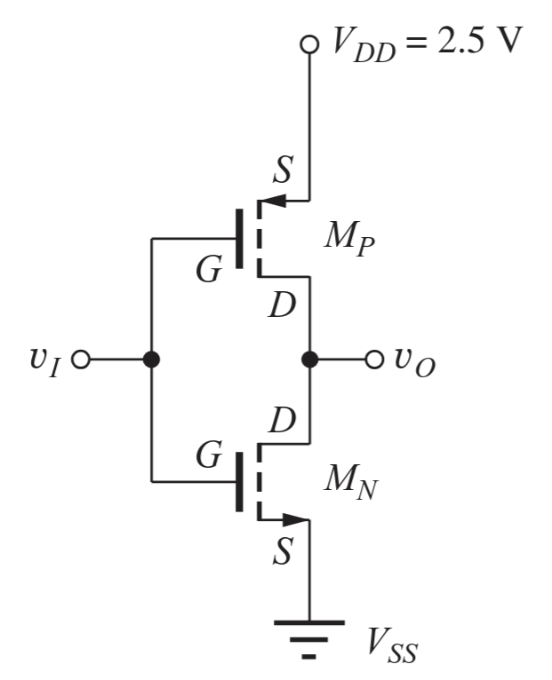

---
description:
  Analisi delle capacità parassite nei transistor pMOS, consumo statico nella
  logica nMOS e vantaggi della logica CMOS.
lang: it
title: Capacità del transistore pMOS e logica CMOS
---

## Capacità nel transistore pMOS

La struttura del transistore presenta diversi capacitori intrinseci:

- tra gate e canale;
- tra gate e source/drain (overlap);
- nei diodi parassiti;
- altre non linearità a seconda della zona di funzionamento;

La capacità si manifesta soprattutto nel transitorio. Negli invertitori, la
capacità può essere modellata come un condensatore posto all'uscita $V_O$.

## Consumo statico

La logica nMOS presenta un problema di consumo statico.

- Quando l'uscita è al livello alto, la corrente consumata è regolata dal
  circuito di uscita.
- Quando è bassa, il pull-down fa passare corrente che viene 'sprecata'.

## Logica CMOS

Nella logica CMOS (complementary MOS), sia il pull-up pMOS sia il pull-down nMOS
sono controllati dallo stesso segnale $V_I$. In questo modo non si hanno perdite
statiche di corrente per alcuno stato logico.

Lo 0 e 1 logici corrispondono alle tensioni di alimentazione, quindi i margini
di rumore saranno grandi. Inoltre c'è una bassa impedenza in uscita, che aumenta
l'immunità ai disturbi e una bassa impedenza in entrata che permette di
concatenare molte più porte.

