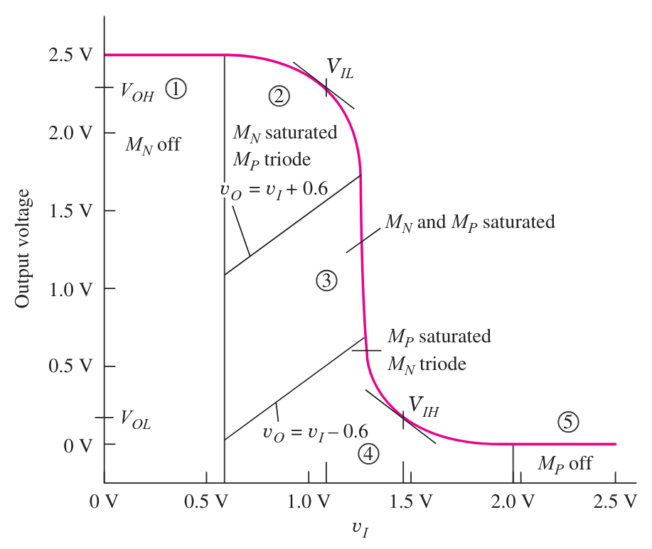
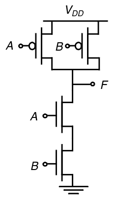

---
description:
  Caratteristica statica dell'invertitore CMOS, tensione di soglia, consumo
  dinamico, porte logiche complesse e dimensionamento dei transistori.
lang: it
title: Funzionamento e consumo dinamico dell'invertitore CMOS
---

## Caratteristica statica dell'invertitore CMOS

L'invertitore CMOS può essere suddiviso in 5 zone di funzionamento in base alla
tensione di ingresso:

1. L'nMOS è spento e il pMOS è acceso.
2. L'nMOS è in zona di saturazione e il pMOS in zona triodo.
3. Entrambi in zona di saturazione.
4. Il pMOS va in zona di saturazione e l'nMOS in zona triodo.
5. Il pMOS si spegne e l'nMOS è acceso.

## Tensione di soglia

La tensione di soglia di una porta è il punto in cui la tensione di ingresso è
uguale a quella di uscita:

$$
V_{Th} \implies V_O = V_I
$$

Per trovarla si usa la seguente formula ottenuta dall'uguaglianza delle correnti
dei transistori in regione di saturazione:

$$
V_{Th} = \frac{V_{DD} - |V_{Tp}| + \sqrt{\frac{k_n}{k_p}}\,V_{Tn}}{1 + \sqrt{\frac{k_n}{k_p}}}
$$

Agendo sui parametri $k_n$ e $k_p$, la tensione di soglia cambia, ampliando i
margini di rumore alto o basso.

## Consumo di potenza dinamico

Nella logica CMOS non c'è un consumo di potenza statico considerabile, dato che
a regime non c'è mai un cammino diretto tra alimentazione e massa.

Il consumo avviene durante la fase di transizione. Ad ogni cambio di stato si
sposta della carica dal generatore al condensatore intrinseco, o dal
condensatore alla massa.

Assumendo che inizialmente la capacità sia scarica, a $t = 0$ si chiude
l'interruttore. Il pMOS carica il condensatore tramite la sua resistenza
interna.

L'energia fornita è $E_D = \int_0^{+\infty} P(t)\,dt$, dove
$P(t) = V_{DD}\,i(t)$. La corrente è quella che scorre nel condensatore
$i(t) = C\,\frac{dV_C}{dt}$.

Integrando, risulta che l'energia fornita $E_D$ è $C\,V_{DD}^2$, quella
immagazzinata nel condensatore $E_S$ è $\frac{1}{2}\,C\,V_{DD}^2$. L'energia
dissipata è quindi $E_L = E_D - E_S = \frac{1}{2}\,C\,V_{DD}^2$.

Metà dell'energia fornita viene trasformata in calore dal transistore per
effetto Joule.

Se la porta commuta ad una frequenza $f$ (tipicamente quella di un clock),
allora la potenza totale richiesta è $P_D = C\,V_{DD}^2\,f$.

## Porte logiche complesse

Ogni variabile che appare nella formula logica dà luogo a 2 transistori. Bisogna
creare 2 circuiti con condizioni duali, uno che attiva l'nMOS e l'altro che
disattiva il pMOS e viceversa.

Ad esempio per una NAND:

La logica CMOS richiede un utilizzo di $2n$ transistori rispetto al numero di
porte logiche. Quindi per realizzare circuiti grandi viene richiesta una grande
superficie.

## Dimensionamento dei transistori

Il dimensionamento non è necessario per i livelli di uscita, dato che il range
di output è sempre tra $0$ e $V_{DD}$.

Quello che cambia è il tempo di propagazione. Il ritardo è inversamente
proporzionale a $\frac{W}{L}$:

$$
R_{on} = \frac{1}{K'_n\,\frac{W}{L}\,(V_{GS} - V_{TN})}
$$
