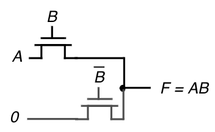
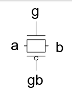
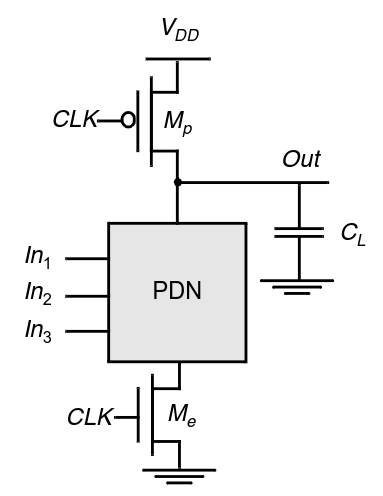

---
description:
  La logica a transmission gate risolve i limiti del pass transistor. La logica
  dinamica riduce il numero di transistori usando fasi di precarica e
  valutazione.
lang: it
title: Logica pass transistor, transmission gate e dinamica
---

## Logica a pass transistor

A differenza della logica CMOS, nella logica a pass transistor il segnale di
ingresso può trovarsi anche sul source o sul drain oltre che sul gate.

In questo caso è possibile collegare $V_I$ direttamente a $V_O$, controllata da
un transitore nMOS.

Una porta AND può essere implementata come nell'immagine:

L'nMOS della logica a pass transistor non riesce a condurre bene gli 1 (l'uscita
arriva al più a $V_"DD" - V_"TN"$) perché il canale svanisce. La situazione è
anche peggiorata dall'effetto body ($V_"SB" != 0$).

:::note

Se usassimo un pMOS, l'1 non avrebbe più problemi, ma lo 0 sì.

:::

## Logica a transmission gate

La logica a transmission gate risolve il problema dei segnali del pass
transistor mettendo in parallelo un transistore nMOS e un pMOS.

Il principale svantaggio è dovuto alla maggiore complessità dovuta all'utilizzo
di 2 transistori e un invertitore. Inoltre tutto il rumore all'ingresso è
passato all'uscita.

:::tip

Per risolvere la questione del rumore, si possono introdurre regolarmente nel
circuito dei buffer di tipo CMOS.

:::

## Logica dinamica

Nella logica dinamica, invece di implementare pull-up e pull-down come nella
CMOS, se ne implementa solo uno e si suddivide in due fasi il circuito:
precarica e valutazione.

Per la suddivisione serve un terzo transistor nMOS in serie al pull-down, che,
insieme al pull-up (pMOS), è comandato da un segnale di clock.

- Nella fase di precarica, il pull-up è acceso e carica la capacità in uscita,
  mentre il pull-down è spento dal terzo transistore.
- Nella fase di valutazione, in base al valore degli ingressi, si decide se il
  nodo di uscita viene portato a 0 o se rimane a 1.

Rispetto alla logica CMOS che usa $2n$ transistors, la logica dinamica ne usa
solo $n + 2$.

Dal punto di vista dei consumi, non ci sono più quelli dovuti alla transizione
di stato del CMOS, ma nel caso in cui il pull-down è acceso, la carica della
capacità viene sprecata per ogni ciclo di clock.
