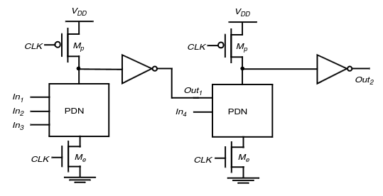
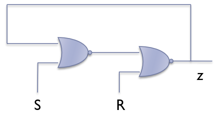
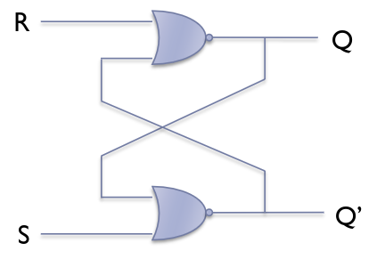
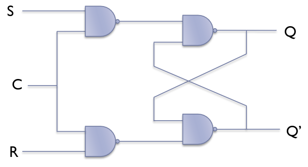

---
description:
  Porte logiche domino per risolvere problemi di cascata, circuiti bistabili e
  flip-flop SR con clock come elementi di memoria nei circuiti digitali
  sequenziali.
lang: it
title: Logica domino e flip-flop SR per circuiti
---

## Logica domino

Due porte dinamiche non possono essere collegate in cascata, dato che ritardi
nello scaricare la capacità e nella diffusione del clock possono generare
malfunzionamenti nel circuito.

In particolare, quando la capacità a monte è carica (ogni mezzo ciclo di clock),
il pull-down a valle è attivo e continua a scaricare la sua uscita. Il problema
si può risolvere **invertendo l'uscita a monte**. In questo modo il pull-down a
valle sarà spento di norma, impedendo di scaricare la sua uscita.

In questo modo, tuttavia, si possono realizzare solo funzioni logiche non
invertenti (una NAND diventa una AND con l'invertitore).

## Logica sequenziale

Finora abbiamo visto diversi modi per realizzare porte logiche, utili nella
costruzione di reti combinatorie.

Ora dobbiamo anche trovare un modo di memorizzare valori (stato del sistema
visto in [reti logiche](../../146129-1)).

Un buffer (2 invertitori in serie) o un condensatore non possono essere usati
perché entrambi si scaricano troppo velocemente.

### Circuiti bistabili

Se chiudiamo ad anello un circuito con un buffer e se il valore all'ingresso
rimane per un intervallo almeno pari al ritardo di propagazione, allora questo
valore sarà mantenuto per almeno un altro ritardo e quindi indefinitamente
finché gli inverter sono alimentati.

Un circuito di questo tipo è detto **bistabile**, dato che per qualsiasi
ingresso esso ritorna ai valori di equilibrio $V_{DD}$ o $0$.

:::note[Oscillatore]

Se al posto di 2 inverter ne usassimo solo 1, il circuito non sarebbe più
stabile, ma il suo valore tenderebbe ad oscillare tra 0 e 1.

Un circuito di questo tipo è detto oscillatore ed è utile per creare dei clock.

:::

### Elemento di memoria

Partendo dal circuito bistabile, vogliamo stabilire e modificare il valore
memorizzato. Per fare ciò si può usare un inverter controllato.

Le porte NOR o NAND invertono o impongono un valore, quindi soddisfano entrambi
i nostri requisiti.

- per $R = 1$ l'uscita va a $0$;
- per $S = 1$ e $R = 0$ l'uscita va a $1$;
- quando $S = R = 0$ il circuito funziona come memoria;

Incrociando i NOR, si ottiene il circuito del flip-flop SR:

:::warn

Con $S = R = 1$ entrambi gli outputs vanno a $0$, violando la relazione
$Q = \overline{\overline{Q}}$. Questo è uno stato proibito. Quando poi $S$ e $R$
tornano a $0$ simultaneamente, il circuito entra in oscillazione e si stabilizza
in uno stato imprevedibile (dipendente da minime differenze di ritardo tra i due
NOR).

:::

### Flip-flop SR con clock

Un ingresso di clock ($C$) controlla quando il flip-flop può cambiare stato. Il
flip-flop è operativo solo quando $C = 1$.

