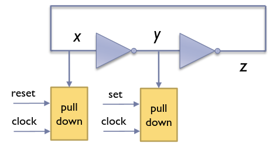
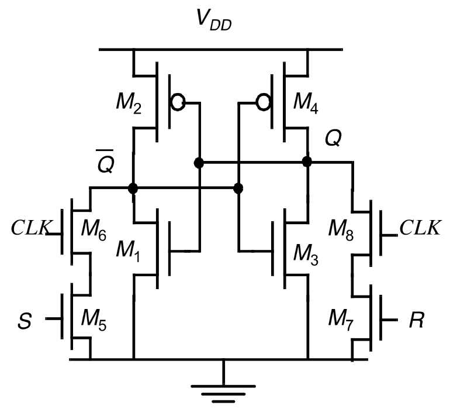
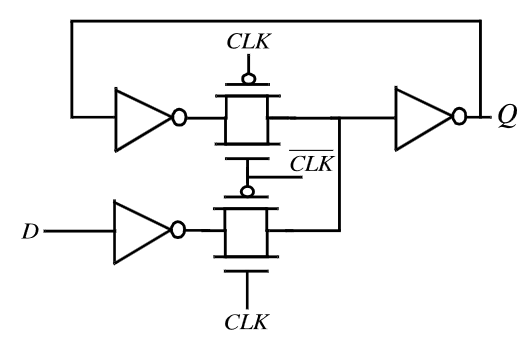
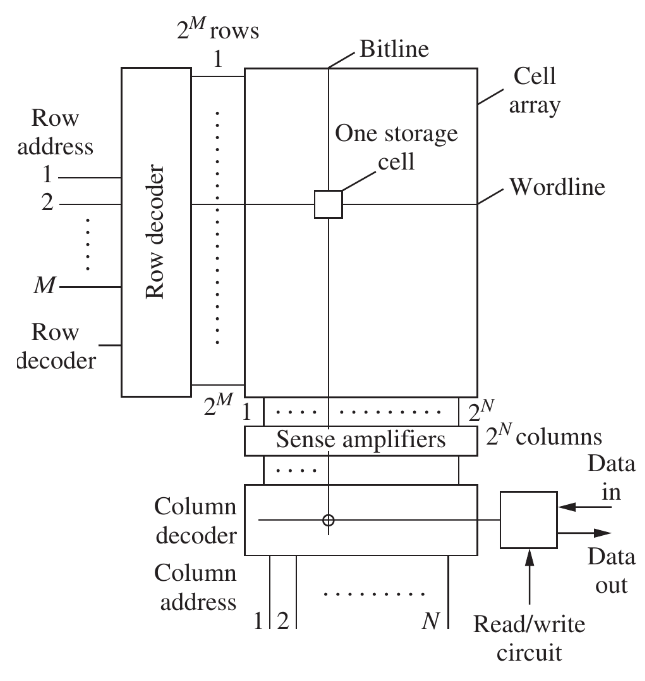
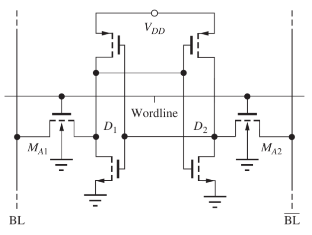

---
description:
  Realizzazione del flip-flop SR ottimizzato, latch basato su multiplexer,
  configurazione master-slave edge-triggered e organizzazione delle memorie RAM.
lang: it
title: Flip-flop SR, latch multiplexer e memorie RAM
---

## Flip-flop SR ottimizzato

Una versione più compatta del flip-flop SR con clock si può realizzare ponendo
dei pull-down di fronte agli invertitori.

I pull-down aggiunti devono essere 'più forti' di quelli degli invertitori,
ovvero devono portare la tensione in entrata al di sotto della tensione di
soglia dell'invertitore.

### Ritardo di commutazione

Il ritardo tra l'attivazione del reset e la commutazione di $Q'$ è dato da 2
componenti:

- Il ritardo per portare $Q$ a $V_"DD" / 2$ dovuto all'inverter pseudo nMOS
  fatto da $M_4$ e $M_8 + M_7$.
- Il ritardo dovuto all'inverter CMOS composto da $M_1$ e $M_2$.

## Latch basato su multiplexer

Il flip-flop può essere realizzato utilizzando dei multiplexer, che sono molto
facili da realizzare in logica transmission gate.

Quando il clock $C = 1$ viene letto l'ingresso $D$, mentre quando va a $0$ il
dato resta memorizzato.

Il vantaggio è un minore consumo, dato che non c'è un pull-down che deve
continuamente 'combattere' il pull-up per portare l'uscita a massa. Tuttavia
bisogna usare un maggior numero di transistor.

## Flip-flop master-slave

Tutte le memorie viste finora lavorano su un livello. Se l'ingresso si aggiorna
in mezzo al ciclo alto di clock, l'uscita si aggiorna subito. In molte
applicazioni è utile invece aspettare di cambiare l'uscita fino al prossimo
fronte del clock.

Per fare questo, si mettono in cascata 2 latch SR: il primo aperto quando il
clock è alto e il secondo quando il clock è basso.

Non c'è mai un cammino diretto tra ingresso e uscita e quindi non si possono
trasmettere modifiche avvenute durante il ciclo di clock.

:::note

Il flip-flop edge-triggered funziona allo stesso modo, ma il master è un latch
di tipo D.

:::

## Memorie RAM

Le memorie RAM sono organizzate a matrice:

1. un decoder seleziona la riga (**wordline**) dalla prima metà dell'indirizzo;
2. tutta la riga viene letta;
3. i sense amplifier amplificano i valori nelle celle lette;
4. un multiplexer (column decoder) seleziona la colonna (**bitline**) e quindi
   la cella desiderata usando l'altra metà dell'indirizzo;

Ogni cella funziona come visto in precedenza: 2 invertitori incrociati
(flip-flop statico), controllati da pass transistors.

