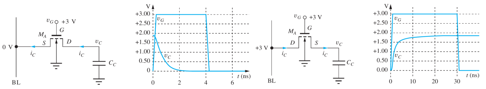
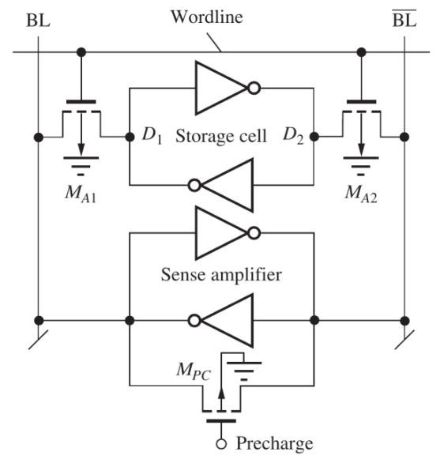

---
description:
  Lettura e scrittura di celle SRAM e DRAM con dimensionamento dei transistor,
  funzionamento del sense amplifier e problematiche delle memorie dinamiche
lang: it
next: false
title: Funzionamento celle memoria e sense amplifier
---

## Lettura di una cella

Supponiamo che $V_"DD" = 3V$.

1. Mentre la wordline è ancora disattivata, la bitline è precaricata a
   $V_"DD" / 2$ per rendere più veloce la lettura.
2. Si attiva la wordline, che fa accendere i transistor (nMOS, per occupare meno
   spazio) e che di conseguenza fanno scendere o salire la bitline.
3. La variazione di valore sulla bitline è molto piccola. Il sense amplifier
   porta le bitline a valori logici 0 o 1.

I transistor devono essere dimensionati in modo tale da evitare che la precarica
della bitline faccia invertire il valore memorizzato.

## Scrittura di una cella

1. Si pilotano le bitline al valore da memorizzare.
2. Si attiva la wordline che fa aprire i transistor.

Le celle che pilotano le bitline devono essere dimensionate in modo da
sovrascrivere sempre il valore già memorizzato nella cella.

## Cella RAM dinamica

In una cella RAM dinamica, il dato viene memorizzato su un condensatore.

Il vantaggio principale è la minore area occupata dal circuito. Tuttavia le
correnti di leakage sono tali da mantenerlo solo per pochi millisecondi e il
valore 1 non arriva a $V_"DD"$ a causa dell'effetto body.

Una lettura scarica la capacità, quindi dopo ogni operazione è necessario
riscrivere il dato letto per non azzerare la memoria.

## Sense amplifier

Il sense amplifier è un circuito molto simile al latch bistabile:

Una piccola variazione da $V_"DD" / 2$ (punto di lavoro instabile) fa sì che il
circuito si porti verso lo 0 o 1 logico.

I transistor in basso sono quelli che impongono inizialmente la tensione
$V_"DD" / 2$ e contemporaneamente caricano le bitline. I valori memorizzati
generano poi una piccola variazione che porta il sense amplifier a 0 o 1.
