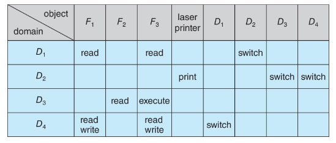

---
description:
  Protection domains, hardware rings, access matrix implementations, and Linux
  security mechanisms including capabilities, seccomp filtering, and code
  signing.
lang: en
title: Operating system protection and access control
---

## OS protection

In a protection model, a computer consists of a collection of objects, either
hardware or software. Each object has a unique name and can be accessed through
a well-defined set of operations.

A protection domain defines the set of resources that a process or entity can
access, along with the types of operations it may perform on those resources.

### Domain switching

A process normally executes within the protection domain of the user who started
it. Some operations require privileges not normally available to that user.

Such switches must be limited, explicit, and auditable.

Three commonly used approaches are:

- `setuid`: if a special permission bit is set on an executable, the process can
  run with UID $x$ even when invoked by user $y$.
- `su`: a command that allows a user to temporarily switch to another user's
  full domain. It typically requires the target user's password.
- `sudo`: a command that allows users to execute specific commands as root or
  another specified user.

### Hardware-enforced protection

Protection rings implement protection domains at the CPU privilege level. Rings
are usually named from 0 (most privileged/trusted) to the highest number (least
privileged/trusted).

To perform a privileged operation, the application code must use the `syscall`
instruction. The CPU switches to kernel mode and jumps to a predefined
entrypoint. The kernel checks permissions and performs the operation.

### Access matrix

An access matrix is used to represent permissions at a granular level. It
formalizes the relationship between subjects (who wants to access) and objects
(what is being accessed), defining specific access rights.



Domains can also be objects to support setting permissions for domain switching.

Generally, the matrix is sparse, so storing every possible combination would be
wasteful. Four data structures are typically used:

- **Global table**: stores ordered triples of (domain, object, rights-set). To
  evaluate an operation, the entire table must be searched.

- **Access list for objects**: each column is implemented as an access list for
  one object. To evaluate an operation, the object's list is consulted to check
  whether it contains the requesting domain and rights-set pair.

- **Capability list for domains**: like the access list, but domain-oriented. A
  capability list contains (object, rights-set) pairs for each domain.

  The list is associated with the domain but cannot be read or modified by the
  domain itself. A process must request access via syscalls, and the kernel
  verifies the request by consulting the list.

- **Lock-key**: each object has a list of unique bit patterns called locks, and
  each domain has a list of patterns called keys. A process in a domain can only
  access the object if it possesses the matching key.

ACLs and capability lists are the two most common implementations.

## Modern protection mechanisms

### Linux capabilities

Capabilities extend the traditional UNIX model of privileged vs. unprivileged
users. The root privilege is split into smaller units and a process can be given
only the privileges that it needs.

Each process has the following capability sets:

- **permitted**: capabilities that the process is allowed to make effective;
- **effective**: capabilities currently active and enforced by the kernel;
- **inheritable**: capabilities that are preserved across `exec()`;

### Seccomp

Seccomp (secure computing mode) acts as a firewall for system calls and can also
inspect their arguments.

A policy is installed per process, defining which syscalls are permitted. The
kernel checks each call against the policy.

It is widely used in containers, sandboxes, and browser isolation to reduce the
attack surface in untrusted environments.

```c
#include <stdio.h>
#include <unistd.h>
#include <seccomp.h>

int main() {
    // Allow all syscalls by default.
    scmp_filter_ctx ctx = seccomp_init(SCMP_ACT_ALLOW);

    // Kill the process if getpid is called.
    seccomp_rule_add(ctx, SCMP_ACT_KILL_PROCESS, SCMP_SYS(getpid), 0);

    seccomp_load(ctx);

    printf("loaded policy");

    getpid();

    printf("you shouldn't see this");

    return 0;
}

// Compile with gcc <source> -lseccomp
```

### Code signing

Code signing allows a system to verify the origin and integrity of a program by
using a cryptographic signature that the developer applies to the executable.

If the code is modified, the signature becomes invalid, and some systems will
disallow execution.
